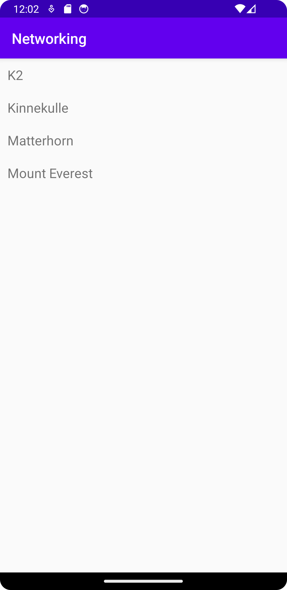

# Rapport
Det jag har gjort är att skapa en mountain-class i vilken det finns metoder för att hämta och sätta olika variabler. 
Jag har även skapat en recyklerviewadapter som hanterar hur mountainobjecten visas. I mainactivity har jag 
gjort så att en datan om de olika bergen hämtas och läggs till i en lista. 

```
        for (Mountain mountain : ListOfMountains) {
            Log.d("Mountain", mountain.toString());
            items.add(new Mountain(mountain.getName()));
        }

```
